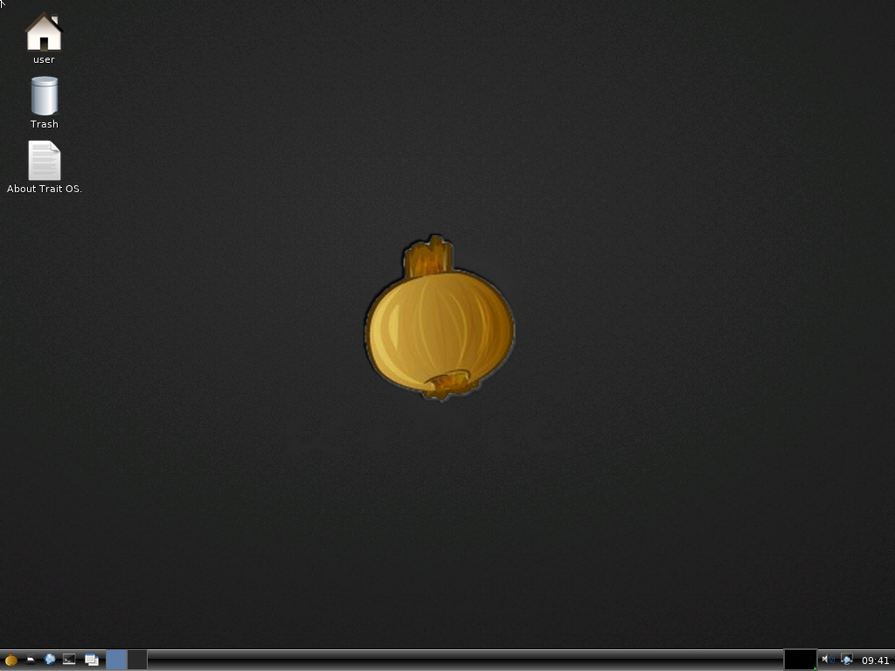

<p align="center">
  
</p>

<h1 align="center">Trait OS</h1>

<p align="center"><strong>A minimal, fully privacy-focused operating system built from scratch.</strong></p>

<p align="center">
  <a href="https://github.com/saudaljuaid/Trait-OS/actions/workflows/verify.yml"></a>
  
  <a href="LICENSE"></a>
</p>


Trait OS is a freestanding x86_64 operating system with its own kernel,
drivers, desktop, application ABI, package path, and test environment. Privacy
is the reason for the project: the long-term goal is a small system whose data
flows can be understood, limited, and tested instead of hidden behind a large
stack.

This is active development software. The privacy model is still being built
and reviewed, so the current release should not be treated as anonymous,
certified, or ready for high-risk everyday use.

<p align="center">
  
</p>

## What exists today

- A 64-bit kernel written in C, Rust, and assembly, without Linux underneath.
- NVMe, USB, audio, networking, FAT32, and an ext4/JBD2 integration boundary.
- A lightweight desktop with a small set of native applications.
- Signed package manifests, explicit trust roots, TLS, and bounded native
  process interfaces.
- 115 automated QEMU scenarios, including reboot and deliberate power-cut
  recovery paths.
- Native ports of outside software including Lua, SQLite, SDL 2, zlib, and
  selected BusyBox compatibility profiles.

The tests define what the project has measured. They do not turn a development
build into a security or privacy certification.

## Build and boot

Ubuntu 24.04 or a compatible Debian system is the reference host:

```sh
sudo apt-get install binutils gcc grub-common grub-pc-bin make mtools \
    qemu-system-x86 xorriso
rustup target add x86_64-unknown-none

make verify
make run
```

`make run` boots Trait OS in QEMU. `make verify` runs the fast local acceptance
suite. The longer hardware, filesystem, process, networking, and ABI sweeps run
in GitHub Actions.

## How it is built

C and assembly own the machine-facing paths. Rust checks selected untrusted
byte streams before C consumes them and also supports native applications. The
Boot Ledger records startup progress so failed or skipped stages remain
visible.

The public SDK, kernel include namespace, tools, package metadata, diagnostics,
and release artifacts all use the Trait OS identity. The onion logo and default
wallpaper are original project artwork imported byte-for-byte from
[`saudaljuaid/Trait-UI`](https://github.com/saudaljuaid/Trait-UI); exact source
and hashes are recorded in [`docs/BRAND.md`](docs/BRAND.md).

## Read more

- [Architecture](docs/ARCHITECTURE.md)
- [Trait OS desktop](docs/TRAIT.md)
- [Privacy and trust boundaries](docs/ARCHITECTURE.md)
- [Application loader](docs/APPLICATION_LOADER.md)
- [Package manager](docs/PACKAGE_MANAGER.md)
- [TLS](docs/TLS.md)
- [Persistent FAT32](docs/FAT32.md)
- [ext4/JBD2 boundary](docs/EXT4.md)
- [Networking](docs/NETWORKING.md)
- [Processes](docs/MULTIPROCESS.md)
- [Linux syscall boundary](docs/LINUX_SYSCALL_ABI.md)
- [Verification](docs/VERIFICATION.md)
- [Source and asset provenance](docs/THIRD_PARTY_ASSETS.md)

Please read [CONTRIBUTING.md](CONTRIBUTING.md) before opening a pull request.
Trait OS is licensed under [GPL-3.0-only](LICENSE).
